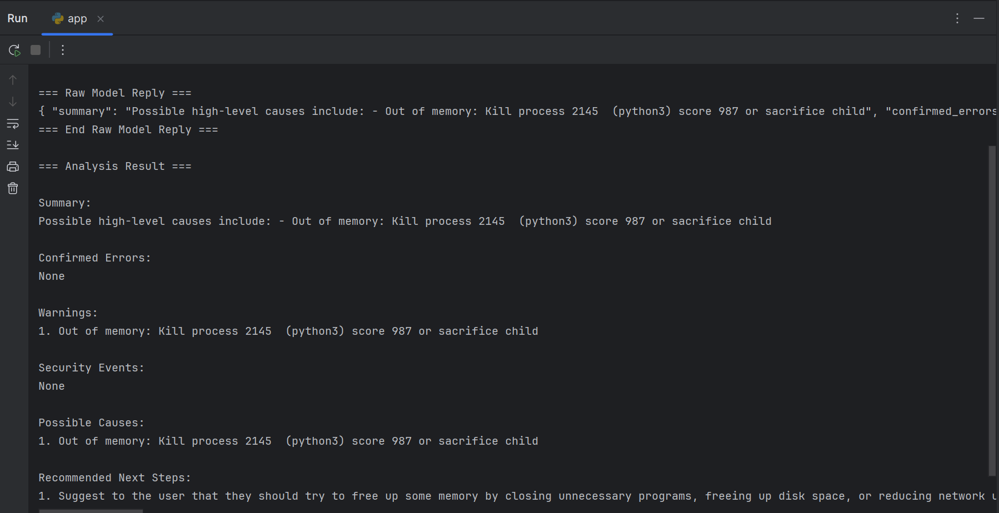
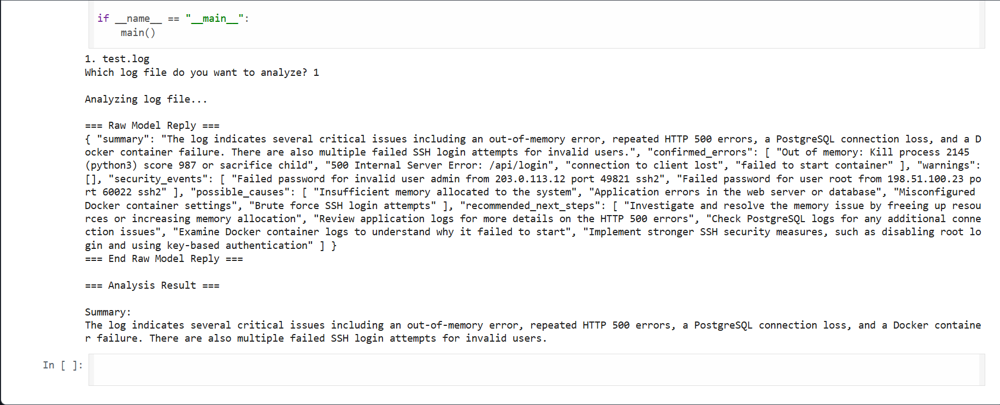

# Project Goals

The goal of this project is to understand how to communicate/interact with an AI model on my local machine, as well as to understand the concept of parameters and how they affect responses from AI models. To accomplish this goal, a Linux log analyzer program was created. The program would ask an AI model (qwen/qwen2.5:7b) to analyze the text and provide an actionable response to the user. I started this project in python, but had to use Google Colab in order to run the qwen:7b model. 

# Project Structure

```text
ollama_testing/
    ├── ollama_test.py      # A test program that makes a call to a specific model (qwen) saying hello
    ├── ollama_client.py    # Defines how we communicate with our AI model 
    ├── app.py              # Shows available log files and prompts user to choose one to analyze
    └── logs/
        ├── test.log
        └── test2_no_oom.log

ollama_test_qwen7b_colab_test/
    ├── colab_ollama_log_analyzer.ipynb    #Accomplishes the same task as the files in ollama_testing by using Google Colab. My local machine does not suffice to run a 7b parameter model, Colab allows us to see the differences in a response from qwen vs qwen:7b. 

```
# Model Responses

**Python implementation**


**Google Colab implementation**


    The different responses from our implementations highlight the importance of hardware resources and models with more parameters. When writing the python implementation, all the testing happened on my own local machine. Even with a 12th Gen Intel(R) Core and 8 gb ram, I could barely run any models, especially ones with larger parameters. Colab allowed me to implement a larger model since all the virtual hardware resources were being dedicated to that singular task. This in turn allowed us to get better responses as the model had more parameters. A parameter is like a weight in a network, when you increase the parameters you are providing: more connections, more memory patterns, more ways to model data relationships, etc. 

    There are of course other minor differences between the two implementations. The Google Colab implementation had a reduced log size (max_char = 4000) and an increased timeout (timeout=600). The max char limitation helped keep responses more focused and the timeout increase was necessary in order to generate a response. Lastly, Colab is using an official pyton wrapper for ollama when calling for a response (response = ollama.chat(...)), which helps with JSON formatting/handling. 

    When looking at the actual response from the Python implementation, we can immediately see that it is mostly just copying text from the log file rather than abstracting any actual meaning from it. The responses is limited in the information it provides and does not provide many actionable solutions. On the contrary, the Colab response was able to decipher further meaning from the log and provide the user with actionable solutions (Colab code can be further refined).  

